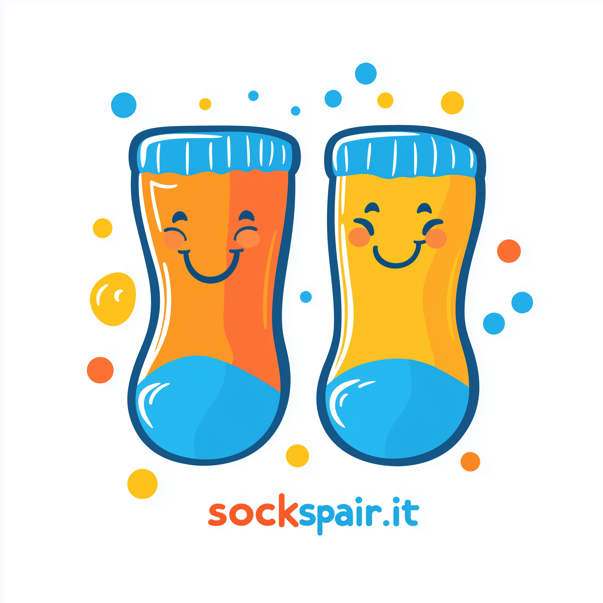

# 🧦 Sockspair.it

**Welcome to Sockspair.it – The Official Sock Matching Hub!**  
Say goodbye to lonely, single socks. We’re on a mission to help you (and your socks) find the perfect match – literally! Our app pairs rogue socks, scans, matches, and reunites your forgotten foot warmers like never before.

---

## 🛠️ **What We Do at Sockspair.it** 🛠️

- **🧦 Sock Pairing Tech**: We’ve built an AI so advanced, it could probably recognize your sock in a crowd… of other socks. 🧠✨
- **📱 Mobile Matchmaking**: With our React Native app, you can take your sock-matching game anywhere, from the laundry room to your closet.
- **💻 Backend Magic**: Built with .NET Core and GraphQL, our backend is as efficient as a freshly organized sock drawer.
- **🎉 Event-Driven Awesomeness**: Every sock pairing action, every match – we keep track of it all for that perfect pair history. Never lose sight of a matched sock again!

> 🧦 **Fun Fact**: "Our system recognizes patterns better than your aunt at Christmas!"

---

## 🧰 **App Architecture** 🧰

Sockspair.it is more than just a mobile app; it's a sock-matching machine! Here’s a peek under the hood:

- **📱 User-Friendly Mobile App**: Built with React Native for a seamless experience on the go. Sock pairing, matching, and history – all at your fingertips.
  
- **💾 Backend System**: Our powerhouse backend has multiple services, each dedicated to a piece of the sock puzzle:
  - **🧩 BFF**: The Backend for Frontend layer – connects our mobile app to the backend world through a slick GraphQL API.
  - **👤 User Service**: Manages your sock-loving account, using CQRS and DDD patterns for ultra-reliable data management.
  - **🧦 Sock Management**: Keeps tabs on each sock, making sure none are left behind.
  - **📸 Image Recognition Service**: Google Vision API-driven tech for automatic sock ID and image magic. No more mix-ups!
  - **💞 Matching Service**: This is where the sock-matching magic happens, pairing socks with precision.
  - **🕒 History Service**: Keeps a detailed account of every match, mismatch, and swap, so you can relive the magic.
  - **🔔 Notification Service**: Get notified whenever a new match is found or a lonely sock reappears!

- **🔄 Async Communication**: Powered by RabbitMQ, our services talk to each other like the sock dream team they are, keeping everything smooth and efficient.

> 🛑 **Sock Tip**: "Never underestimate the power of a well-matched pair."

---

## 🔐 **Security & Login with Keycloak** 🔐

Security is serious business at Sockspair.it. We use Keycloak for login, so you (and your socks) are safe. Log in with peace of mind and enjoy the benefits of OAuth2 and OpenID Connect for smooth and secure access.

---

## 📞 **Get in Touch** 📞

Got questions? Lost a sock? Looking to chat about sock tech? We’re here for you:

- **Email**: [lonely.sock@sockspair.it](mailto:lonely.sock@sockspair.it)  
  *We promise we won’t send sock spam – just helpful updates.*

---

> 💡 **Sock Wisdom**: "A good match is hard to find… unless you have Sockspair.it."

---

*"Reuniting lost socks one pair at a time. Because every sock deserves a match!"*
